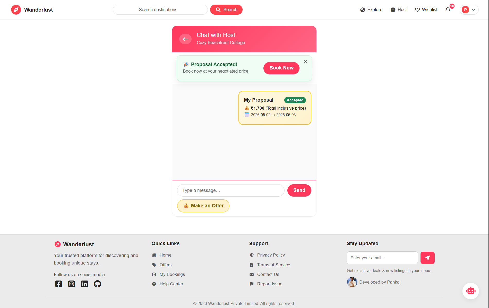
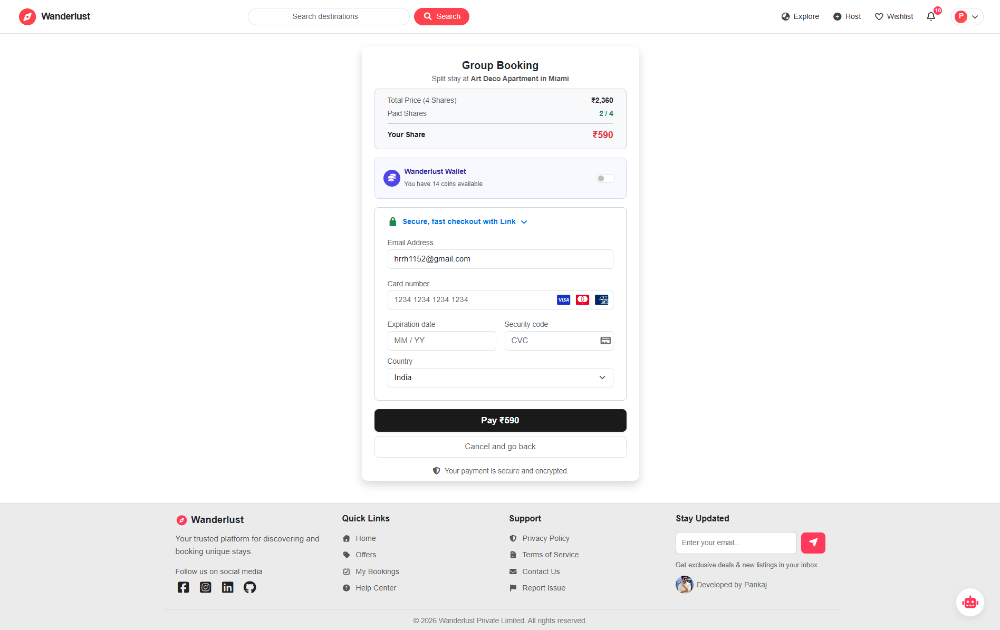

# 🚀 Wanderlust | Travel Booking Platform

[](https://nodejs.org/)
[](https://expressjs.com/)
[](https://www.mongodb.com/)
[](https://aistudio.google.com/)
[](https://stripe.com/)
[](https://www.maptiler.com/)
[](https://cloudinary.com/)
[](https://getbootstrap.com/)

---

🌐 **🚀 Live Demo:** https://wanderlust-project-nhvd.onrender.com  
📌 **GitHub Repo:** https://github.com/Pankaj001238072/Wanderlust_Project

---

## 💡 About the Project

**Wanderlust** is a full-stack travel booking platform that allows users to explore, wishlist, and book unique stays.

This project started as a learning journey and evolved into a **production-level application** with real-world features like dynamic pricing, negotiation, and group payments.

---

## 🎯 Problem It Solves

Most travel platforms lack flexibility in pricing, personalization, and group booking.

**Wanderlust solves this by:**

* 💬 Price negotiation between users and hosts
* 💸 Split payments for group bookings
* 📈 Dynamic pricing based on real-time factors

---

## 🎥 Demo

👉 https://res.cloudinary.com/dxn4y5zlg/video/upload/v1775211521/wanderlust_video_xjsvrq.mp4

> ⚠️ Note: Real-time chat, negotiation, split payment and dynamic pricing features were added after this demo recording.

---

## 📸 Screenshots

### 🏠 Home Page


### 📝 Signup Page


### 🔐 Login Page


### ❤️ Wishlist


### 🔍 Listings


### 💳 Booking Flow


### 💬 Chat & Negotiation



### 💸 Split Payment



### 🤖 AI Assistant


---

## 🌟 Key Features

### 🔐 Secure System

* Authentication (Signup/Login/Logout)
* Session-based login (MongoDB store)
* CSRF Protection, Helmet, Rate Limiting
* Joi Validation

### 🏠 Core Features

* Listings CRUD
* Reviews & Ratings
* Wishlist
* User Profiles

### 💳 Booking System

* Stripe Payments
* Email Confirmation
* Cancellation & Refund

### 🤖 Smart Features

* AI Travel Assistant (Gemini)
* Real-time Notifications
* Email System (Nodemailer)

---

## 💎 Advanced Features

### 📈 Dynamic Pricing

* Weekend surge (+15%)
* Summer Peak Season 🎊 +10%
* Last-minute discount (-20%)

### 💬 Chat & Negotiation

* Socket.io real-time messaging
* Offer-based booking system

### 💸 Split Payments

* Divide booking among friends
* Booking confirmed after full payment

### 🗺️ Geospatial Search

* MongoDB `$near` queries

### ☀️ Weather Recommendations

* OpenWeather API based suggestions

---

## ⚡ Engineering Highlights

* Real-time system using Socket.io
* MongoDB geospatial queries
* Secure Stripe payment flow
* Optimized images using Sharp & Cloudinary

---

## 🧠 System Design Highlights

* Booking state management (Pending → Paid)
* Modular MVC architecture
* Scalable backend design
* Safe concurrent booking handling

---

## ⚔️ Challenges & Learnings

* Real-time chat sync issues
* Split payment handling
* Preventing double bookings
* API security (CSRF, rate limit)

---

## 🚀 Future Roadmap

### 🧠 AI & Personalization

* AI Itinerary Planner
* AI Bio-Sync

### 💰 Smart Pricing & Payments

* Flex-Stay (Hourly Booking)
* Price-Drop Protection
* Escrow-based payment system

### 🤝 Social Features

* Stay-Share
* Split-the-Cab

### 🏡 Experience Layer

* Smart Access
* Culture-Quests

---

## 🛠️ Tech Stack

### Backend

* Node.js, Express.js, MongoDB, Mongoose
* Passport.js, Socket.io, Joi

### Frontend

* EJS, Bootstrap

### Integrations

* Stripe
* Cloudinary
* MapTiler
* Nodemailer
* Google Gemini
* OpenWeather API

---

## 📂 Project Structure

```
MAJORPROJECT/
├── controllers/
├── helpers/
├── init/
├── middlewares/
├── models/
├── public/
├── routes/
├── schemas/
├── screenshots/
├── utils/
├── views/
├── app.js
├── socket.js
```

---

## 🚀 Setup Instructions

### 1️⃣ Clone & Install

```bash
git clone https://github.com/Pankaj001238072/Wanderlust_Project.git
npm install
```

### 2️⃣ Create .env File

```env
ATLASDB_URL=
SESSION_SECRET=

STRIPE_SECRET_KEY=
STRIPE_PUBLISHABLE_KEY=

MAP_TOKEN=

CLOUD_NAME=
CLOUD_API_KEY=
CLOUD_API_SECRET=

EMAIL_USER=
EMAIL_PASS=

OPENWEATHER_API_KEY=
GEMINI_API_KEY=

BASE_URL=http://localhost:8080

SMTP_HOST=
SMTP_PORT=
SMTP_USER=
SMTP_PASS=
PAYMENT_SESSION_TTL_MIN=
```

### 3️⃣ Run Project

```bash
npm start
```

---

## 📩 Contact

Developed by **Pankaj Singh**

🔗 LinkedIn: https://www.linkedin.com/in/pankaj-878772224/  
📧 Email: pankajsaini71004@gmail.com
---

## ⭐ Support

Give a ⭐ if you like the project!

---

License: MIT
