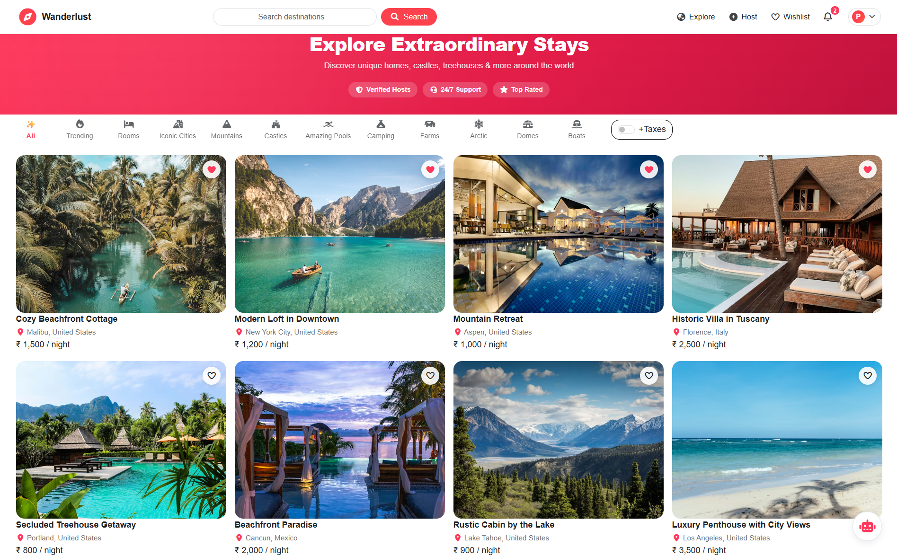
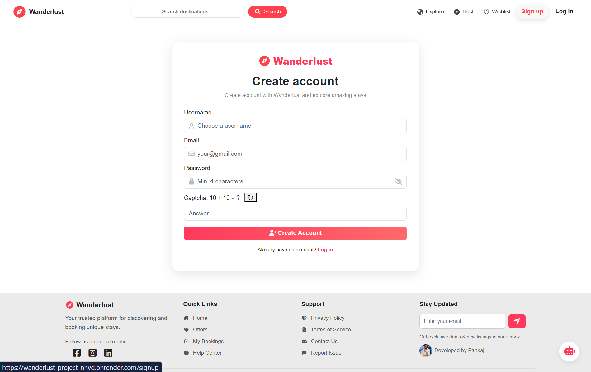
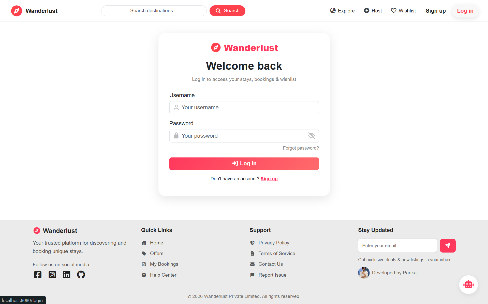
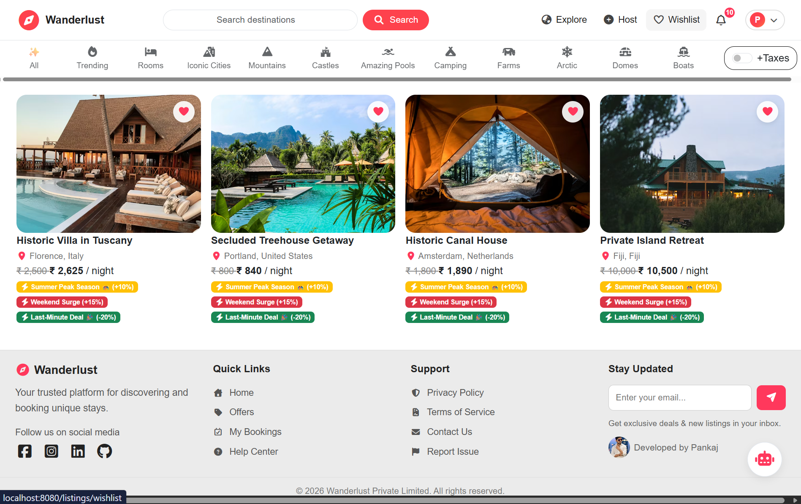
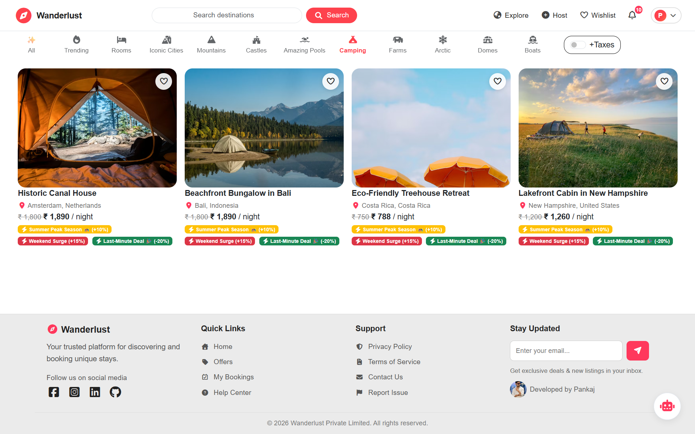
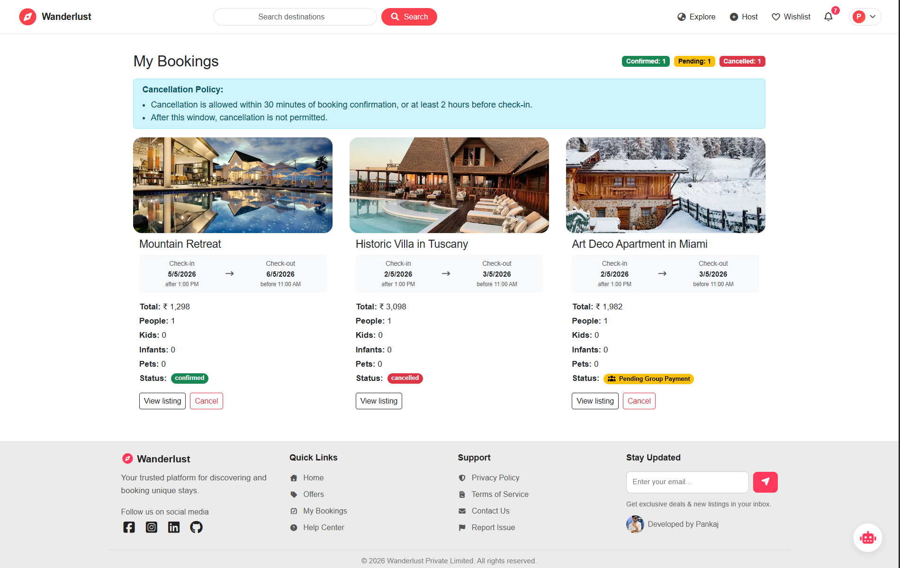
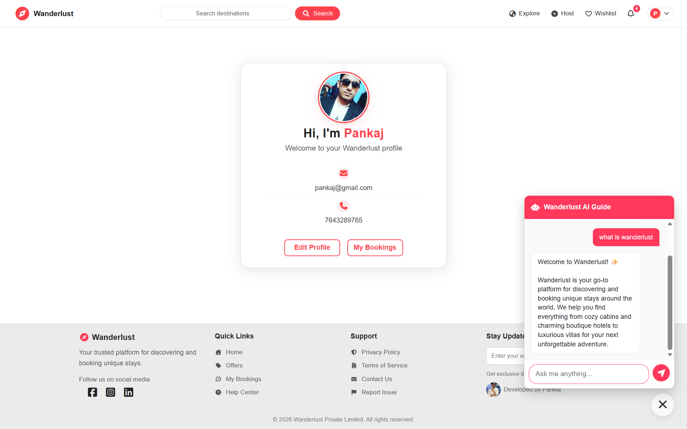

# 🚀 Wanderlust | Travel Booking Platform

[](https://nodejs.org/)
[](https://expressjs.com/)
[](https://www.mongodb.com/)
[](https://aistudio.google.com/)
[](https://stripe.com/)
[](https://www.maptiler.com/)
[](https://cloudinary.com/)
[](https://getbootstrap.com/)

🌐 **🚀Try it Live:** https://wanderlust-project-nhvd.onrender.com  

📌 **GitHub Repository:** https://github.com/Pankaj001238072/Wanderlust_Project

---

## 💡 About the Project

**Wanderlust** is a full-stack travel booking platform where users can explore, wishlist, and book unique stays.

This project started as a learning journey, but I extended it by adding multiple advanced real-world features like:

* AI chatbot integration (Google Gemini)
* Secure booking system with Stripe
* Real-time notifications system
* Full backend security implementation

👉 The goal was to build a production-level application, not just a tutorial project.

---

## 📸 Screenshots

### 🏠 Home Page


### 📝 Signup Page


### 🔐 Login Page


### ❤️ Wishlist



### 🔍 Search & Listings


### 💳 Booking Flow


### 🤖 AI Travel Assistant


---

## 🎥 Demo Video
👉 https://res.cloudinary.com/dxn4y5zlg/video/upload/v1775211521/wanderlust_video_xjsvrq.mp4

---

## 🌟 Key Features

### 🔐 Secure System

* Authentication (Signup/Login/Logout)
* Session-based login (MongoDB store)
* CSRF protection, Helmet, Rate Limiting
* Joi validation for all inputs

### 🏠 Core Features

* Listings CRUD (Create, Read, Update, Delete)
* Reviews & Ratings
* Wishlist system
* User profile management

### 💳 Booking System

* Stripe payment integration
* Booking confirmation emails
* Cancellation & refund handling

### 🤖 Smart Features

* AI Travel Assistant (Google Gemini)
* Real-time in-app notifications
* Newsletter & email system (Nodemailer)

### 🗺️ Maps & Media

* MapTiler integration (location-based listings)
* Cloudinary image upload & storage
* Sharp image optimization

---

## 🛠️ Tech Stack

### Backend

* Node.js
* Express.js
* MongoDB
* Mongoose
* Passport.js (Authentication)
* Joi (Validation)

### Frontend

* EJS
* Bootstrap 5
* Custom CSS (Glassmorphism UI)

### Integrations

* Stripe (Payments)
* Cloudinary (Image Hosting)
* MapTiler (Maps)
* Nodemailer (Emails)
* Google Gemini AI

---

## 📂 Project Structure

```
MAJORPROJECT/
├── controllers/
├── helpers/
├── init/
├── middlewares/
├── models/
├── public/
├── routes/
├── schemas/
├── screenshots/
├── tests/
├── uploads/
├── utils/
├── views/
├── .env
├── app.js
├── cloudConfig.js
├── middleware.js
├── schema.js
├── package.json
└── README.md
```

---

## 🚀 Setup Instructions

### 1️⃣ Clone Repository
```bash
git clone https://github.com/Pankaj001238072/Wanderlust_Project.git
cd Wanderlust_Project
```

### 2️⃣ Install Dependencies
```bash
npm install
```

### 3️⃣ Create .env File
```env
ATLASDB_URL=
SESSION_SECRET=
STRIPE_SECRET_KEY=
STRIPE_PUBLISHABLE_KEY=
MAP_TOKEN=
CLOUD_NAME=
CLOUD_API_KEY=
CLOUD_API_SECRET=
SMTP_HOST=
SMTP_PORT=
SMTP_USER=
SMTP_PASS=
PAYMENT_SESSION_TTL_MIN=
GEMINI_API_KEY=
```

### 4️⃣ Run Project
```bash
npm start
```

👉 Open: http://localhost:8080
---

## 📈 Future Improvements

* Real-time chat using Socket.io
* “Near Me” geospatial search
* Dynamic pricing system
* Group booking (split payment)
* Loyalty & referral system

---

## 🤝 Contribution

Contributions are welcome!
Feel free to fork and improve the project.

---

## 📩 Contact

Developed by **Pankaj Singh**

🔗 LinkedIn: https://www.linkedin.com/in/pankaj-878772224/

📧 Email: pankajsaini71004@gmail.com

---

## ⭐ Support

If you like this project, consider giving it a ⭐ on GitHub!

---

License: MIT